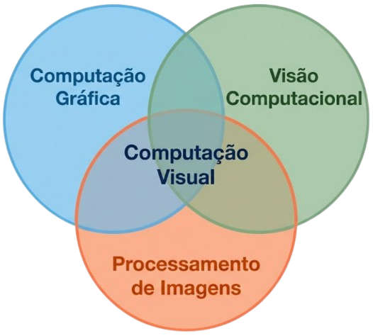

# Computação Visual

**19/08/2026**

### O que você achava que veria na disciplina?

Quando vi o nome "Computação Visual", eu achava que aprenderíamos na prática a história de como programar pixels na tela e ordená-los a fazer o que queremos.

Pensei que desenharíamos na tela formas geométricas básicas como um quadrado, até formas 3D, girando, como um cubo... ou um donut.

Entender como figuras 3D são desenhadas, como a perspectiva de andar dentro de um ambiente 3D é programado (objetos 3D se distanciando e se aproximando), como consertar problemas visuais como serrilhado, entre outros. Daí o "visual" em "computação visual" que eu tinha entendido.

### O que você entendeu que estudaremos?

Entendi agora que "Computação Visual" foi o nome dado à disciplina porque na verdade ela é um pouco de tudo:

Um pouco disso que eu falei mas não tão aprofundando quanto o que eu falei, um pouco de computação gráfica, de GPU, de análise de imagens, entre outras áreas de computação... visuais! Faz sentido agora!

A disciplina de Computação Visual é um pouco de Computação Gráfica, Visão Computacional e Processamento de Imagens:

---

[Voltar à página inicial](index.md)
