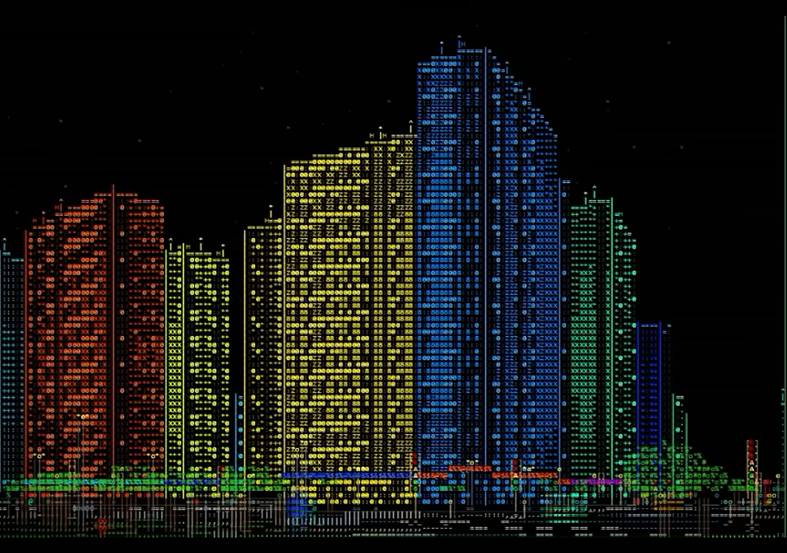

# Uma cidade inteira e com vida em ASCII

**19/08/2026**

No meu post anterior, eu expliquei sobre o que eu esperava da disciplina Computação Visual.

Esses dias, encontrei um vídeo no YouTube que mostra exatamente o tipo de expectativa que eu tive inicialmente quando li o nome da disciplina... porém em outro nível!! 🤯

O vídeo mostra o tipo de programação que eu me referia quando disse que esperava que "programaríamos pixels para criar um donut girando na tela".

Porém, nesse vídeo, o programador foi muito além da minha imaginação do que era possível e programou cada pixel (ou ASCII, nesse caso) de uma ***cidade inteira***, ***com vida*** ainda por cima!

Pessoas e carros se movendo em relação ao telespectador, não apenas os objetos se distanciando dele de acordo com os movimentos dele. Não são modelos com polígonos, são pixels (ASCII) sendo desenhados um a um. Absurdo!

Achei este projeto muito inspirador, recomendo muito checar! Ele mesmo explica no vídeo melhor do que eu poderia o quão incrível é este projeto:

https://www.youtube.com/watch?v=3YtygAx_C6A

O canal do programador! ➡️ https://www.youtube.com/@GrowNowGames

---

[Voltar à página inicial](index.md)
