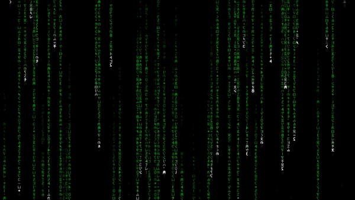
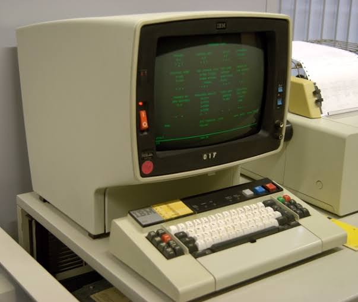
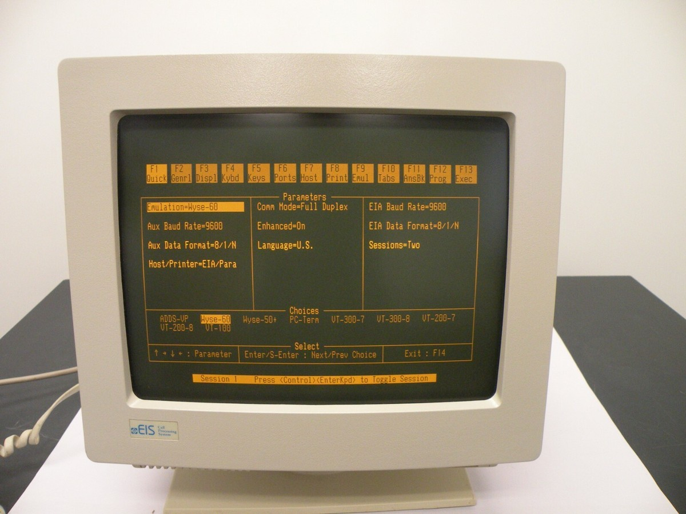
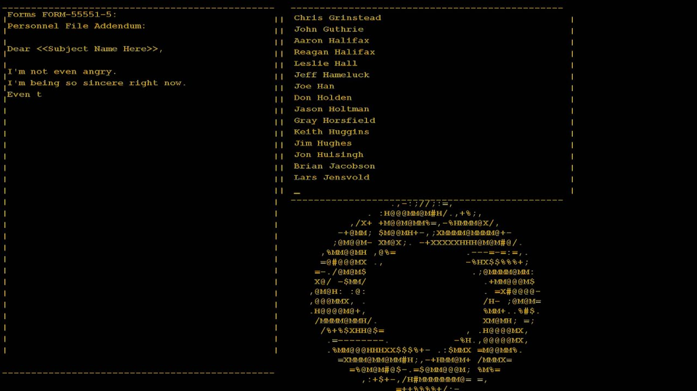

# Monitores CRT monocromáticos

**02/09/2026**

Um dia eu me perguntei por quê o "**fundo preto com texto verde**" é uma das principais combinações de cores para representar a computação?

A outra representação principal, muito predominante também, é o "fundo preto com texto azul". É um pouco mais sem graça, mas faz sentido, eu diria que é porque azul lembra ciência e tecnologia num geral, não se limita especificamente à computação. Enquanto a representação "fundo preto texto verde" existe apenas na computação.

O fundo preto com texto verde principalmente aparece pare representar um "hacker" num filme.

É sempre instantaneamente reconhecível, ao ponto de virar clichê.

O motivo dessa estética surgir é por causa dos monitores antigos, claro. Eles tinham tela preta e texto verde, mas por quê?

Estes monitores se chamam **monitores de CRT monocromáticos**. Ou seja, *(mono-)* possuem uma única *(-cromáticos)* cor. O "CRT" significa Cathode Ray Tube (Tubo de Raios Catódicos) porque eles funcionavam, resumidamente, assim:

- A parte de trás do monitor é um grande **tubo** de vidro fechado a vácuo.
- Ele possui ***1*** **canhão de elétrons** para disparar feixes de elétrons contra uma **tela revestida de** ***fósforo***.
- Quando os elétrons batem no ***fósforo***, ele brilha e cria a cor e imagem que você vê.

"Monitores de CRT" *não são mais* necessariamente monocromáticos, apenas os primeiros eram, pois tinham apenas ***1*** **canhão de elétrons**. Anos depois, é desenvolvido o monitor de CRT com ***3*** **canhões de elétrons**, um para o vermelho (R), verde (G) e azul (B).

Mas então, **por que verde especificamente** para o monitor CRT *monocromático*? Por que não outra cor?

Porque **verde era a cor emitida pelo tipo de fósforo que venceu** dentre as outras opções de fósforos. A outra opção de fósforo mais famosa que competiu com o verde foi o **âmbar**. Assim, existiram por muito tempo **2** fósforos de cores vitoriosas:

- **P1 - Verde** - Vitorioso de todas as opções existentes e também mais utilizado que o de âmbar. Possuía alta eficiência luminosa, ou seja, necessitava de pouca energia para fazer bastante luminosidade em comparação à outras opções. Além disso, o olho humano é naturalmente mais sensível ao comprimento de onda da cor verde, fazendo com que a luz também parecesse mais brilhante gastando ainda menos energia.
- **P3 - Âmbar** - O âmbar foi a segunda opção famosa, porém ainda não atingiu a mesma popularidade do verde. Ele também possuía alta eficiência luminosa suficiente, porém surgiu oferecendo uma "alternativa saudável" ao verde por dizerem que causava menos fadiga visual em uso prolongado, mas isso não é um fato confirmado.

Eu achei legal descobrir que o monitor CRT monocromático era verde por motivos técnicos de eficiência e performance, e que também existia um segundo tipo de cor famosa, a cor âmbar. Então, depois de sentir uma certa familiaridade com um monitor de cor âmbar, apesar de pensar que é a primeira vez que vejo ela... foi quando me lembrei!

O jogo Portal mostra um terminal monocromático âmbar na cena de créditos finais quando você zera o jogo e ouve aquela musiquinha super memorável! Então é daí que senti a familiaridade.

---

[Voltar à página inicial](index.md)