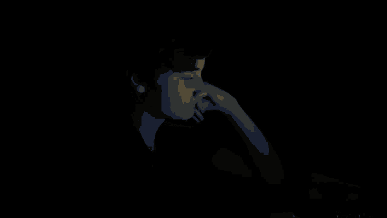
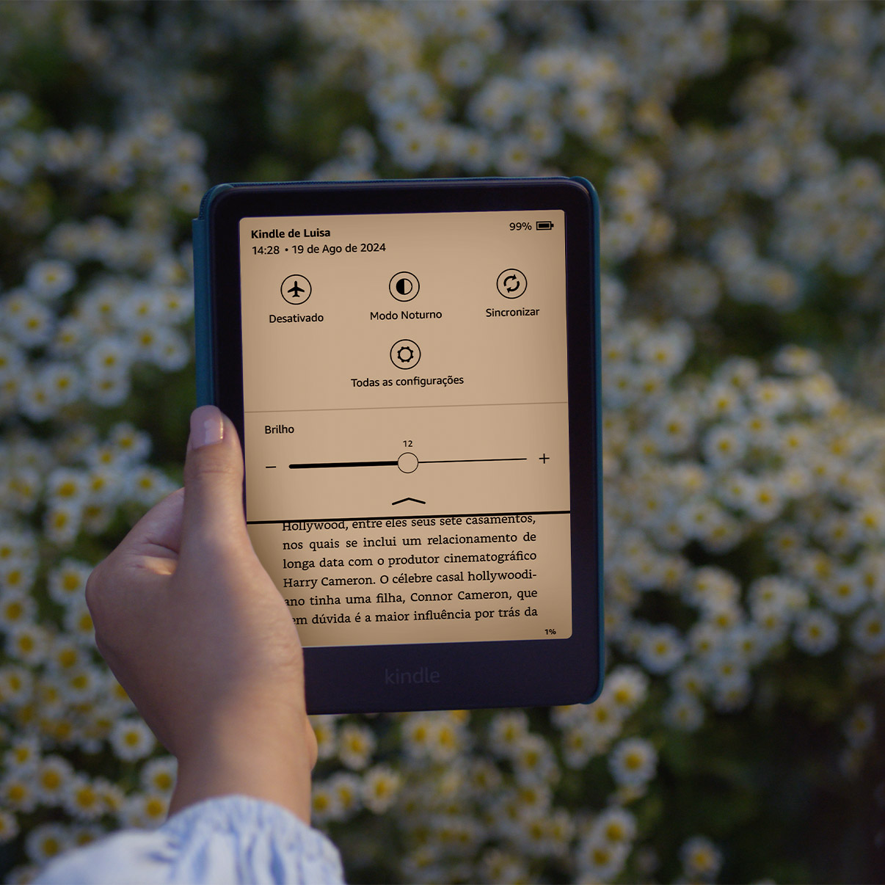

# O que faz uma tela ser desconfortável para os olhos?

**17/09/2026**

No meu blog anterior eu falei dos antigos Monitores CRT monocromáticos. Um dos pontos que explorei é a competição dos monitores de cor **verde** VS os de cor **âmbar** que surgiram prometendo ser mais saudáveis/confortáveis para os olhos em relação aos verdes em longos períodos de uso.

Como alguém que trabalha no computador por horas seguidas, eu sei que as dores de cabeça, o desgaste e o desconforto causado aos olhos de olhar para uma tela por longos períodos de tempo ***é um problema muito real até hoje***.

Meus olhos são tão sensíveis que meu computador inteiro é configurado para o **dark theme** e, sempre que aparece qualquer site ou software que não ofereça dark theme, eu imediatamente uso extensões ou modificações que forçam a troca do fundo branco por preto nestas aplicações.

Além disso, para ler livros, eu prefiro usar um **Kindle**, um tablet cuja tela foi pensada especialmente para ser confortável à visão e não machucar os olhos em longos prazos e/ou lendo palavras pequenas.

Isso tudo me fez chegar na pergunta: ***O que faz uma tela ser confortável ou desconfortável aos olhos no longo prazo?***

Ao pesquisar, aprendi que o conforto depende, principalmente, de **3** coisas diferentes: **Como a luz chega** até você, o **espectro** dela, e o **contraste** da interface (tanto do seu conteúdo quanto em relação ao ambiente ao redor).

- **Como a luz chega (Kindle VS telas LED/OLED):** Celular e monitor são **emissivos**, ou seja, **produzem luz e mandam ela pro meu olho**. O Kindle usa **e-ink**, que **reflete a luz do ambiente**, como papel. Pesquisas mostram que a leitura com e-ink chega bem perto do conforto de ler papel real. [Saiba mais](https://www.bgr.com/2144201/science-behind-digital-eye-strain-kindle-e-ink-explained/)
- **O espectro da luz (luz azul):** "Luz azul faz mal pro olho" é algo que passei a ouvir direto, mas a verdade é que a luz azul não exatamente afeta seu olho, e sim o seu **sono** especificamente. Ela **suprime melatonina** por muito mais tempo que outras luzes, fazendo com que você perca sono. Então apesar de que **a luz azul afeta sim o seu conforto visual no sentido de tirar o seu sono**, algo que o Kindle não causaria por exemplo, **ela não é tão grave para a saúde do seu olho quanto dizem**, tipo "afetar visão a longo prazo". Ou, pelo menos, não há comprovação suficiente para dizer isso ainda da mesma forma que foi comprovada a influência negativa no sono. Na dúvida, evitar o excesso é sempre o ideal. [Saiba mais](https://www.aao.org/eye-health/tips-prevention/digital-devices-your-eyes)
- **O contraste da interface (dark mode VS light mode):** Sou completamente team dark theme e sempre achei que isso fosse estritamente melhor pros olhos de todos que usam computador por muito tempo. Só que depois de pesquisar aprendi que **pra leitura/foco light mode costuma performar melhor**, porque a **pupila contrai e foca nas letras com menos esforço**. Ou seja, dark mode na verdade é melhor à noite para **evitar o contraste da tela branca em relação ao escuro do ambiente**, ou em certas condições oculares, mas não é necessariamente o melhor para todos, em todos os momentos. Será que eu tenho condição ocular pró dark theme em tudo? [Saiba mais](https://www.nngroup.com/articles/dark-mode/)

Sendo assim, isso tudo significa que o âmbar do meu blog anterior provavelmente era uma aposta no **segundo** mecanismo, o **espectro da luz**. O verde ficava no pico de sensibilidade do olho (parecia mais nítido gastando pouca energia), enquanto o âmbar se afastava um pouco dessa faixa de sensibilidade, o que ***em teoria*** cansa menos em sessões longas. Só que não achei estudo conclusivo confirmando isso, então nunca irei saber de verdade se não foi apenas marketing ou se era uma diferença mínima ao invés de relevante.

O mais interessante de tudo foi perceber que o conforto visual depende mais de contexto do que eu imaginava: tipo de luz, horário, ambiente, cor da interface, todos esses fatores importam.

---

[Voltar à página inicial](index.md)