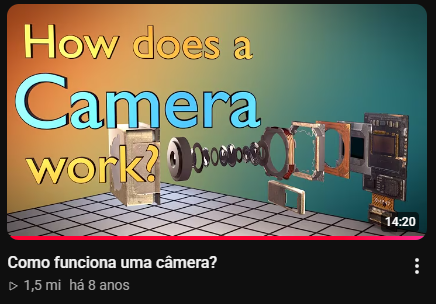

# Vídeo do Branch Education: Como câmeras funcionam?

**01/10/2026**

Estudando para a prova de Computação Visual, eu revisei como funcionam os sensores de câmeras **CMOS** e **CCD**, o professor até compartilhou um vídeo muito legal mostrando o funcionamento delas.

Só que, logo em seguida, descobri que um dos meus canais educativos favoritos, o **Branch Education**, tinha um vídeo explicando ***exatamente*** como câmeras funcionam! Ainda por cima, é o primeiro vídeo do canal deles, que coincidência!

O vídeo mostra tudo o que vimos na disciplina, só que com um nível de profundidade e qualidade de animação tão bom que eu ***precisava*** compartilhar aqui. Ele explica melhor do que eu poderia:

[https://www.youtube.com/watch?v=B7Dopv6kzJA](https://www.youtube.com/watch?v=B7Dopv6kzJA)

O canal do Branch Education! ➡️ [https://www.youtube.com/@BranchEducation](https://www.youtube.com/@BranchEducation)

---

[Voltar à página inicial](index.md)
